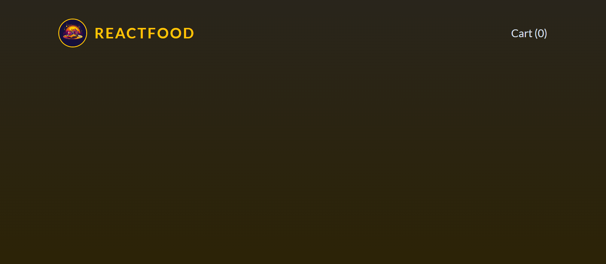
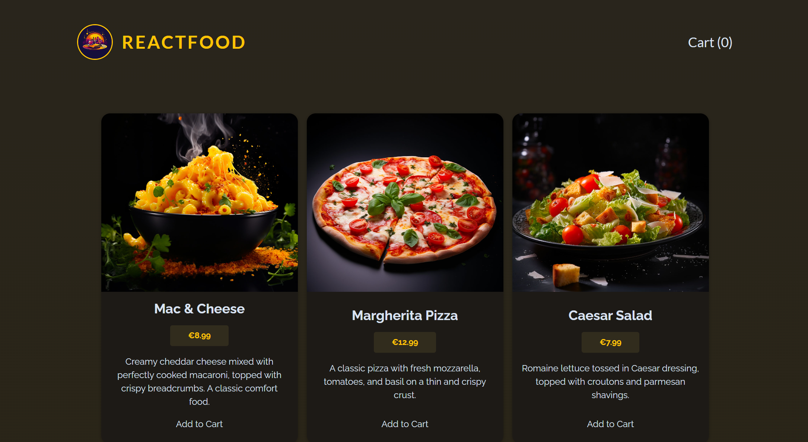

# Food order app with react

## 0. Set up

### 0-0. Install

You need to install depedencies both for the front end and for the dummy back end. <br>

- Backend: `/backend$ npm install`
- Frontend: `$ npm install`

## 0-1. Run application

In order to run the application properly, you need to run both the backend. <br>

- Backend: `/backend$ npm start`
- Frontend: `$ npm run dev`

## 1. Objectives

- Add components for displaying **products**, the **cart** (in a **modal**) and a **checkout form** (in a **modal**)
- **Fetch** the (dummy) meals data from the **backend** and show it on the screen (GET/meals)
- Allow users to **add & remove** products to / from the **cart**
- **Send cart data** along with **user data** (full name, email, street, postal code, city) to the **backend** (POST/orders)
- Handle **loading & error** states

## 2. Planing

1. Add the **Header** component
2. Add the **Meals-related** components & the logic to fetch meals data from a **backend**
3. Add **Cart** logic (add items to cart, edit cart items) & **Checkout** page logic

## 3. Creating the Header component



```
import logoImg from "../../assets/logo.jpg"

export default function Header() {
  return (
    <header id="main-header">
      <div id="title">
        
        <h1>ReactFood</h1>
      </div>
      <nav>
        <button>Cart (0)</button>
      </nav>
    </header>
  );
}
```

## 4. Creating the Meals & Meal component

### 4-0. Creat the Meals component with hard coded params

```
export default function Meals() {
  return (
    <ul id="meals">
        <li className="meal-item">
            <article>
                
                <h3>Mac & Cheese</h3>
                <div className="meal-item-price">€8.99</div>
                <div className="meal-item-description">
                    Lorem ipsum dolor sit amet, consectetur adipiscing elit, sed do
                    eiusmod tempor incididunt ut labore et dolore magna aliqua. Vitae proin sagittis nisl rhoncus mattis rhoncus urna.
                </div>
                <div className="meal-item-actions">
                    <button>Add to Cart</button>
                </div>
            </article>
        </li>

        <li className="meal-item">
            <article>
                
                <h3>Margherita Pizza</h3>
                <div className="meal-item-price">€12.99</div>
                <div className="meal-item-description">
                    Lorem ipsum dolor sit amet, consectetur adipiscing elit, sed do
                    eiusmod tempor incididunt ut labore et dolore magna aliqua. Vitae proin sagittis nisl rhoncus mattis rhoncus urna.
                </div>
                <div className="meal-item-actions">
                    <button>Add to Cart</button>
                </div>
            </article>
        </li>

        <li className="meal-item">
            <article>
                
                <h3>Ceasar Salad</h3>
                <div className="meal-item-price">€7.99</div>
                <div className="meal-item-description">
                    Lorem ipsum dolor sit amet, consectetur adipiscing elit, sed do
                    eiusmod tempor incididunt ut labore et dolore magna aliqua. Vitae proin sagittis nisl rhoncus mattis rhoncus urna.
                </div>
                <div className="meal-item-actions">
                    <button>Add to Cart</button>
                </div>
            </article>
        </li>
    </ul>
  );
}
```

### 4-1. Create the reuseable Meal component and replace contents

**Meals.jsx**

```
import Meal from "./Meal.jsx";

export default function Meals() {
  return (
    <ul id="meals">
      <Meal
        img="./logo.jpg"
        title="Mac & Cheese"
        price="8.99"
        description="Lorem ipsum dolor sit amet, consectetur adipiscing elit, sed do
        eiusmod tempor incididunt ut labore et dolore magna aliqua. Vitae
        proin sagittis nisl rhoncus mattis rhoncus urna."
      />

      <Meal
        img="./logo.jpg"
        title="Margherita Pizza"
        price="12.99"
        description="Lorem ipsum dolor sit amet, consectetur adipiscing elit, sed do
        eiusmod tempor incididunt ut labore et dolore magna aliqua. Vitae
        proin sagittis nisl rhoncus mattis rhoncus urna."
      />

      <Meal
        img="./logo.jpg"
        title="Ceasar Salad"
        price="7.99"
        description="Lorem ipsum dolor sit amet, consectetur adipiscing elit, sed do
        eiusmod tempor incididunt ut labore et dolore magna aliqua. Vitae
        proin sagittis nisl rhoncus mattis rhoncus urna."
      />
    </ul>
  );
}
```

<br>

**Meal.jsx**

```
export default function Meal({ img, title, price, description }) {
  return (
    <li className="meal-item">
      <article>
        
        <h3>{title}</h3>
        <div className="meal-item-price">€{price}</div>
        <div className="meal-item-description">{description}</div>
        <div className="meal-item-actions">
          <button>Add to Cart</button>
        </div>
      </article>
    </li>
  );
}
```

### 4-2. Replace hard coded data with the DUMMY array (`Meals.jsx`)

```
const DUMMY_MEALS = [
  {
    "id": "m1",
    "name": "Mac & Cheese",
    "price": "8.99",
    "description": "Creamy cheddar cheese mixed with perfectly cooked macaroni, topped with crispy breadcrumbs. A classic comfort food.",
    "image": "images/mac-and-cheese.jpg"
  },
  {
    "id": "m2",
    "name": "Margherita Pizza",
    "price": "12.99",
    "description": "A classic pizza with fresh mozzarella, tomatoes, and basil on a thin and crispy crust.",
    "image": "images/margherita-pizza.jpg"
  },
  {
    "id": "m3",
    "name": "Caesar Salad",
    "price": "7.99",
    "description": "Romaine lettuce tossed in Caesar dressing, topped with croutons and parmesan shavings.",
    "image": "images/caesar-salad.jpg"
  },
  {
    "id": "m4",
    "name": "Spaghetti Carbonara",
    "price": "10.99",
    "description": "Al dente spaghetti with a creamy sauce made from egg yolk, pecorino cheese, pancetta, and pepper.",
    "image": "images/spaghetti-carbonara.jpg"
  },
]

export default function Meals() {
  return (
    <ul id="meals">
      {DUMMY_MEALS.map((meal) => (
        <Meal
          key={meal.id}
          img={meal.image}
          title={meal.name}
          price={meal.price}
          description={meal.description}
        />
      ))}
    </ul>
  );
}
```

### 4-3. Refactor the components (`Meals.jsx`, `Meal.jsx`)

**Meals.jsx**

```
const DUMMY_MEALS = [
  {
    "id": "m1",
    "name": "Mac & Cheese",
    "price": "8.99",
    "description": "Creamy cheddar cheese mixed with perfectly cooked macaroni, topped with crispy breadcrumbs. A classic comfort food.",
    "image": "images/mac-and-cheese.jpg"
  },
  {
    "id": "m2",
    "name": "Margherita Pizza",
    "price": "12.99",
    "description": "A classic pizza with fresh mozzarella, tomatoes, and basil on a thin and crispy crust.",
    "image": "images/margherita-pizza.jpg"
  },
  {
    "id": "m3",
    "name": "Caesar Salad",
    "price": "7.99",
    "description": "Romaine lettuce tossed in Caesar dressing, topped with croutons and parmesan shavings.",
    "image": "images/caesar-salad.jpg"
  },
  {
    "id": "m4",
    "name": "Spaghetti Carbonara",
    "price": "10.99",
    "description": "Al dente spaghetti with a creamy sauce made from egg yolk, pecorino cheese, pancetta, and pepper.",
    "image": "images/spaghetti-carbonara.jpg"
  },
]

export default function Meals() {
  return (
    <ul id="meals">
      {DUMMY_MEALS.map((meal) => (
        <Meal key={meal.id} meal={meal} />
      ))}
    </ul>
  );
}
```

<br>

**Meal.jsx**

```
export default function Meal({ meal }) {
  return (
    <li className="meal-item">
      <article>
        
        <div>
          <h3>{meal.name}</h3>
          <p className="meal-item-price">€{meal.price}</p>
          <p className="meal-item-description">{meal.description}</p>
        </div>
        <p className="meal-item-actions">
          <button>Add to Cart</button>
        </p>
      </article>
    </li>
  );
}
```

## 5. Add fetch meals data logic



### 5-0. Fetch data from backend (`Meals.jsx`)

```
export default function Meals() {
  const [meals, setMeals] = useState([]);

  useEffect(() => {
    async function fetchMeals() {
      const response = await fetch("http://localhost:3000/meals");
      const resData = await response.json();

      setMeals(resData);
    }

    fetchMeals();
  }, []);

  return (
    <ul id="meals">
      {meals.map((meal) => (
        <Meal key={meal.id} meal={meal} />
      ))}
    </ul>
  );
}
```

### 5-1. Fix the image url (`Meal.jsx`)

If you don't specified the path, the image url is set to the relative path (`localhost:5137`) but actual images are stored in public which can be accessed with `localhost:3000` path. Thus, you need to change the image paths to this ones.

```
export default function Meal({ meal }) {
  return (
    <li className="meal-item">
      <article>
        
        <div>
          <h3>{meal.name}</h3>
          <p className="meal-item-price">€{meal.price}</p>
          <p className="meal-item-description">{meal.description}</p>
        </div>
        <p className="meal-item-actions">
          <button>Add to Cart</button>
        </p>
      </article>
    </li>
  );
}
```

## 6. Formatting & Outputting numbers as currency

### 6-0. Create the reusable formatter

Create a reusable currency formatter inside newly created "src > util" folder. In order to do so, employ the `Intl.NumberFormat` object and set the belgium country code (`sfb`) to put **€** before the number.

```
export const currencyFormatter = new Intl.NumberFormat("sfb", {
  style: "currency",
  currency: "EUR",
});
```

### 6-1. Use it inside the component

To use the formatter, employ the `format` method.

```
import { currencyFormatter } from "../../util/formatting";

export default function Meal({ meal }) {
  return (
    <li className="meal-item">

          ....

          <p className="meal-item-price">{currencyFormatter.format(meal.price)}</p>

          ....

    </li>
  );
}
```
