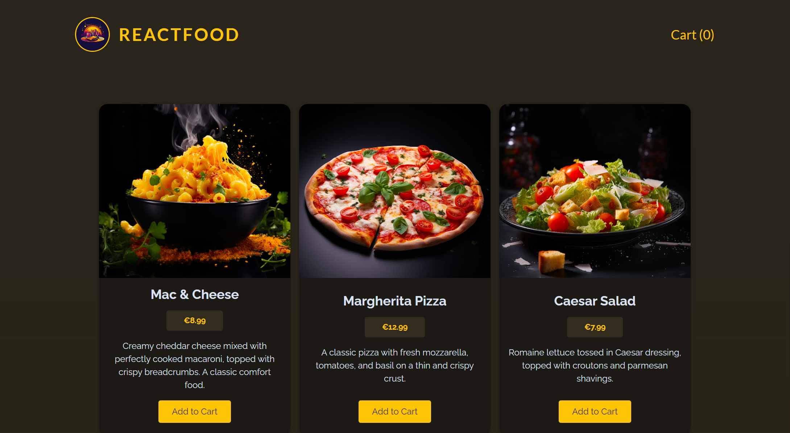
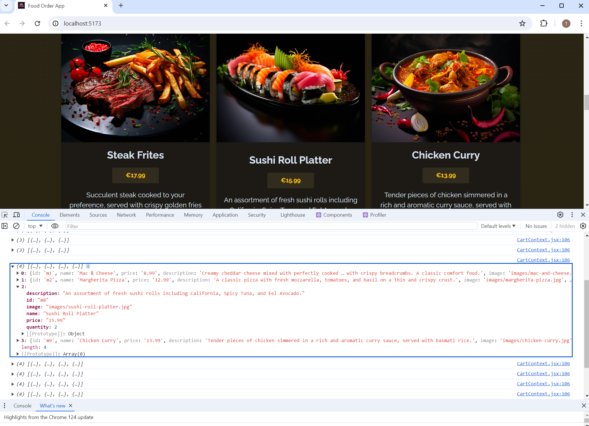
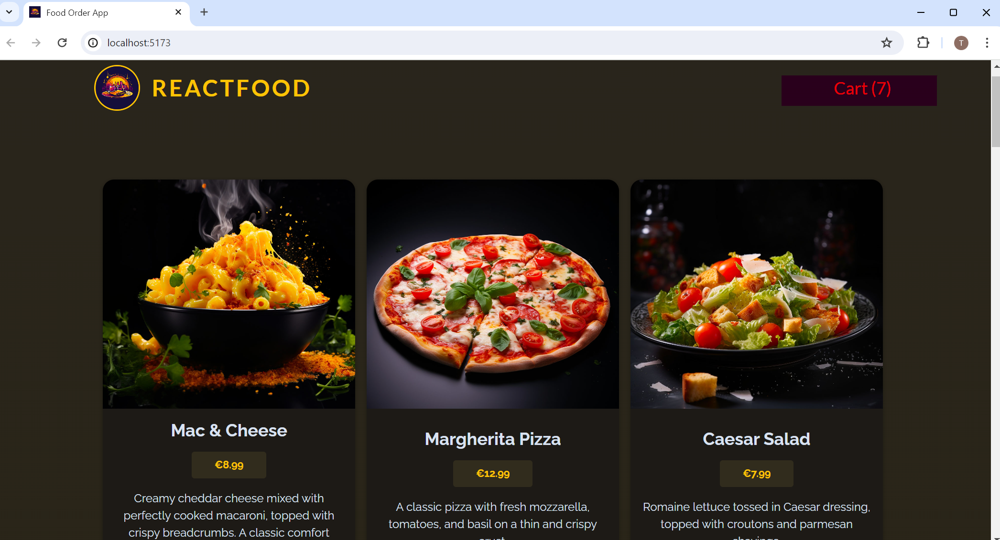
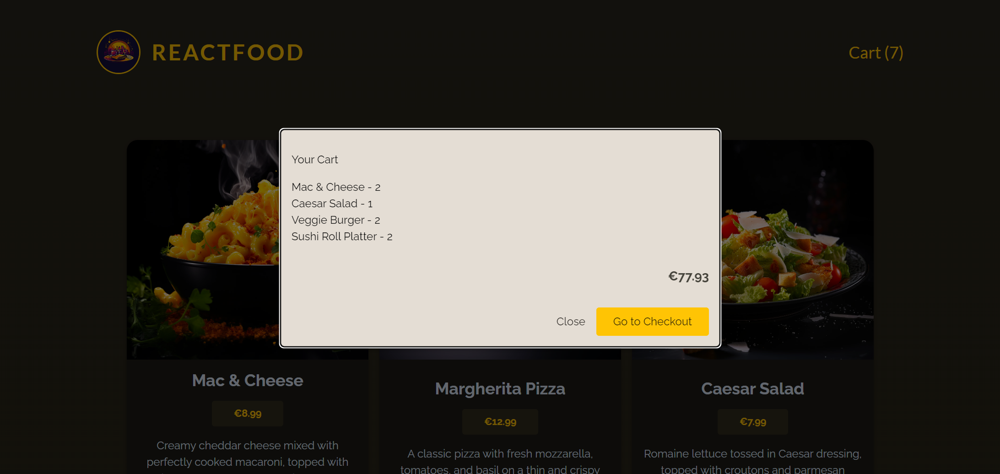
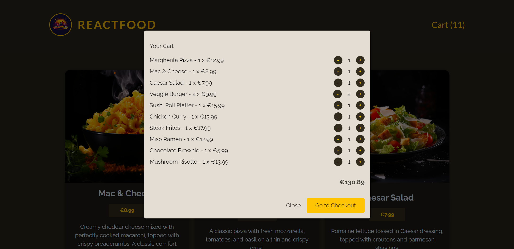
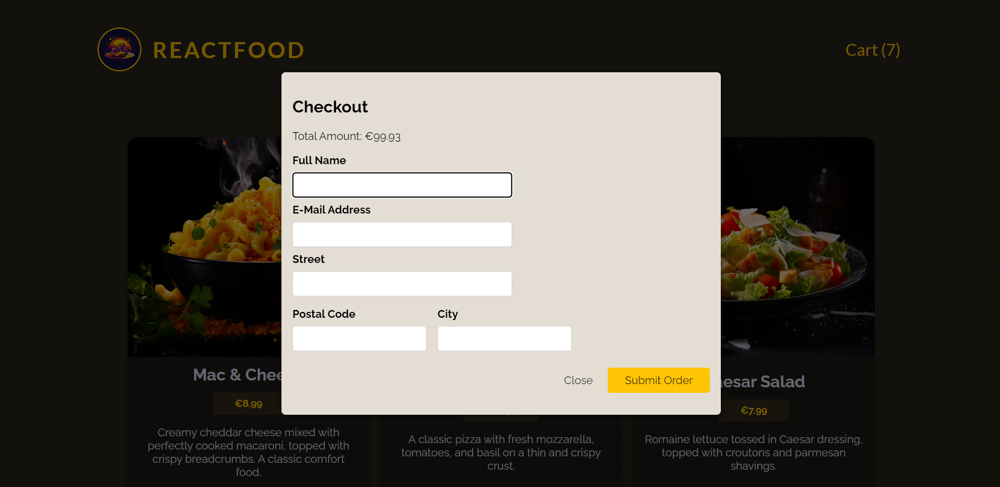

# Food order app with react

## 0. Set up

### 0-0. Install

You need to install depedencies both for the front end and for the dummy back end. <br>

- Backend: `/backend$ npm install`
- Frontend: `$ npm install`

## 0-1. Run application

In order to run the application properly, you need to run both the backend. <br>

- Backend: `/backend$ npm start`
- Frontend: `$ npm run dev`

## 1. Objectives

- Add components for displaying **products**, the **cart** (in a **modal**) and a **checkout form** (in a **modal**)
- **Fetch** the (dummy) meals data from the **backend** and show it on the screen (GET/meals)
- Allow users to **add & remove** products to / from the **cart**
- **Send cart data** along with **user data** (full name, email, street, postal code, city) to the **backend** (POST/orders)
- Handle **loading & error** states

## 2. Planing

1. Add the **Header** component
2. Add the **Meals-related** components & the logic to fetch meals data from a **backend**
3. Add **Cart** logic (add items to cart, edit cart items) & **Checkout** page logic

## 3. Creating the Header component


```
import logoImg from "../../assets/logo.jpg"

export default function Header() {
  return (
    <header id="main-header">
      <div id="title">
        
        <h1>ReactFood</h1>
      </div>
      <nav>
        <button>Cart (0)</button>
      </nav>
    </header>
  );
}
```

## 4. Creating the Meals & Meal component

### 4-0. Creat the Meals component with hard coded params

```
export default function Meals() {
  return (
    <ul id="meals">
        <li className="meal-item">
            <article>
                
                <h3>Mac & Cheese</h3>
                <div className="meal-item-price">€8.99</div>
                <div className="meal-item-description">
                    Lorem ipsum dolor sit amet, consectetur adipiscing elit, sed do
                    eiusmod tempor incididunt ut labore et dolore magna aliqua. Vitae proin sagittis nisl rhoncus mattis rhoncus urna.
                </div>
                <div className="meal-item-actions">
                    <button>Add to Cart</button>
                </div>
            </article>
        </li>

        <li className="meal-item">
            <article>
                
                <h3>Margherita Pizza</h3>
                <div className="meal-item-price">€12.99</div>
                <div className="meal-item-description">
                    Lorem ipsum dolor sit amet, consectetur adipiscing elit, sed do
                    eiusmod tempor incididunt ut labore et dolore magna aliqua. Vitae proin sagittis nisl rhoncus mattis rhoncus urna.
                </div>
                <div className="meal-item-actions">
                    <button>Add to Cart</button>
                </div>
            </article>
        </li>

        <li className="meal-item">
            <article>
                
                <h3>Ceasar Salad</h3>
                <div className="meal-item-price">€7.99</div>
                <div className="meal-item-description">
                    Lorem ipsum dolor sit amet, consectetur adipiscing elit, sed do
                    eiusmod tempor incididunt ut labore et dolore magna aliqua. Vitae proin sagittis nisl rhoncus mattis rhoncus urna.
                </div>
                <div className="meal-item-actions">
                    <button>Add to Cart</button>
                </div>
            </article>
        </li>
    </ul>
  );
}
```

### 4-1. Create the reuseable Meal component and replace contents

**Meals.jsx**

```
import Meal from "./Meal.jsx";

export default function Meals() {
  return (
    <ul id="meals">
      <Meal
        img="./logo.jpg"
        title="Mac & Cheese"
        price="8.99"
        description="Lorem ipsum dolor sit amet, consectetur adipiscing elit, sed do
        eiusmod tempor incididunt ut labore et dolore magna aliqua. Vitae
        proin sagittis nisl rhoncus mattis rhoncus urna."
      />

      <Meal
        img="./logo.jpg"
        title="Margherita Pizza"
        price="12.99"
        description="Lorem ipsum dolor sit amet, consectetur adipiscing elit, sed do
        eiusmod tempor incididunt ut labore et dolore magna aliqua. Vitae
        proin sagittis nisl rhoncus mattis rhoncus urna."
      />

      <Meal
        img="./logo.jpg"
        title="Ceasar Salad"
        price="7.99"
        description="Lorem ipsum dolor sit amet, consectetur adipiscing elit, sed do
        eiusmod tempor incididunt ut labore et dolore magna aliqua. Vitae
        proin sagittis nisl rhoncus mattis rhoncus urna."
      />
    </ul>
  );
}
```

<br>

**Meal.jsx**

```
export default function Meal({ img, title, price, description }) {
  return (
    <li className="meal-item">
      <article>
        
        <h3>{title}</h3>
        <div className="meal-item-price">€{price}</div>
        <div className="meal-item-description">{description}</div>
        <div className="meal-item-actions">
          <button>Add to Cart</button>
        </div>
      </article>
    </li>
  );
}
```

### 4-2. Replace hard coded data with the DUMMY array (`Meals.jsx`)

```
const DUMMY_MEALS = [
  {
    "id": "m1",
    "name": "Mac & Cheese",
    "price": "8.99",
    "description": "Creamy cheddar cheese mixed with perfectly cooked macaroni, topped with crispy breadcrumbs. A classic comfort food.",
    "image": "images/mac-and-cheese.jpg"
  },
  {
    "id": "m2",
    "name": "Margherita Pizza",
    "price": "12.99",
    "description": "A classic pizza with fresh mozzarella, tomatoes, and basil on a thin and crispy crust.",
    "image": "images/margherita-pizza.jpg"
  },
  {
    "id": "m3",
    "name": "Caesar Salad",
    "price": "7.99",
    "description": "Romaine lettuce tossed in Caesar dressing, topped with croutons and parmesan shavings.",
    "image": "images/caesar-salad.jpg"
  },
  {
    "id": "m4",
    "name": "Spaghetti Carbonara",
    "price": "10.99",
    "description": "Al dente spaghetti with a creamy sauce made from egg yolk, pecorino cheese, pancetta, and pepper.",
    "image": "images/spaghetti-carbonara.jpg"
  },
]

export default function Meals() {
  return (
    <ul id="meals">
      {DUMMY_MEALS.map((meal) => (
        <Meal
          key={meal.id}
          img={meal.image}
          title={meal.name}
          price={meal.price}
          description={meal.description}
        />
      ))}
    </ul>
  );
}
```

### 4-3. Refactor the components (`Meals.jsx`, `Meal.jsx`)

**Meals.jsx**

```
const DUMMY_MEALS = [
  {
    "id": "m1",
    "name": "Mac & Cheese",
    "price": "8.99",
    "description": "Creamy cheddar cheese mixed with perfectly cooked macaroni, topped with crispy breadcrumbs. A classic comfort food.",
    "image": "images/mac-and-cheese.jpg"
  },
  {
    "id": "m2",
    "name": "Margherita Pizza",
    "price": "12.99",
    "description": "A classic pizza with fresh mozzarella, tomatoes, and basil on a thin and crispy crust.",
    "image": "images/margherita-pizza.jpg"
  },
  {
    "id": "m3",
    "name": "Caesar Salad",
    "price": "7.99",
    "description": "Romaine lettuce tossed in Caesar dressing, topped with croutons and parmesan shavings.",
    "image": "images/caesar-salad.jpg"
  },
  {
    "id": "m4",
    "name": "Spaghetti Carbonara",
    "price": "10.99",
    "description": "Al dente spaghetti with a creamy sauce made from egg yolk, pecorino cheese, pancetta, and pepper.",
    "image": "images/spaghetti-carbonara.jpg"
  },
]

export default function Meals() {
  return (
    <ul id="meals">
      {DUMMY_MEALS.map((meal) => (
        <Meal key={meal.id} meal={meal} />
      ))}
    </ul>
  );
}
```

<br>

**Meal.jsx**

```
export default function Meal({ meal }) {
  return (
    <li className="meal-item">
      <article>
        
        <div>
          <h3>{meal.name}</h3>
          <p className="meal-item-price">€{meal.price}</p>
          <p className="meal-item-description">{meal.description}</p>
        </div>
        <p className="meal-item-actions">
          <button>Add to Cart</button>
        </p>
      </article>
    </li>
  );
}
```

## 5. Add fetch meals data logic


### 5-0. Fetch data from backend (`Meals.jsx`)

```
export default function Meals() {
  const [meals, setMeals] = useState([]);

  useEffect(() => {
    async function fetchMeals() {
      const response = await fetch("http://localhost:3000/meals");
      const resData = await response.json();

      setMeals(resData);
    }

    fetchMeals();
  }, []);

  return (
    <ul id="meals">
      {meals.map((meal) => (
        <Meal key={meal.id} meal={meal} />
      ))}
    </ul>
  );
}
```

### 5-1. Fix the image url (`Meal.jsx`)

If you don't specified the path, the image url is set to the relative path (`localhost:5137`) but actual images are stored in public which can be accessed with `localhost:3000` path. Thus, you need to change the image paths to this ones.

```
export default function Meal({ meal }) {
  return (
    <li className="meal-item">
      <article>
        
        <div>
          <h3>{meal.name}</h3>
          <p className="meal-item-price">€{meal.price}</p>
          <p className="meal-item-description">{meal.description}</p>
        </div>
        <p className="meal-item-actions">
          <button>Add to Cart</button>
        </p>
      </article>
    </li>
  );
}
```

## 6. Formatting & Outputting numbers as currency

### 6-0. Create the reusable formatter

Create a reusable currency formatter inside newly created "src > util" folder. In order to do so, employ the `Intl.NumberFormat` object and set the belgium country code (`sfb`) to put **€** before the number.

```
export const currencyFormatter = new Intl.NumberFormat("sfb", {
  style: "currency",
  currency: "EUR",
});
```

### 6-1. Use it inside the component

To use the formatter, employ the `format` method.

```
import { currencyFormatter } from "../../util/formatting";

export default function Meal({ meal }) {
  return (
    <li className="meal-item">

          ....

          <p className="meal-item-price">{currencyFormatter.format(meal.price)}</p>

          ....

    </li>
  );
}
```

## 7. Creating a configurable & flexible custom button component



<br>

To create reusable button component, you need to;

- Enable to wrap the element via `children` prop
- Enable to add classNames flexibly with `textOnly` prop
- Enable to inherit the `className` which the wrapped component already has
- Enable to use default `button` properties, use the spread operator (`...`)

```
export default function Button({ children, textOnly, className, ...props }) {
  const cssClasses = textOnly ? `text-button ${className}` : "button";

  return (
    <button className={cssClasses} {...props}>
      {children}
    </button>
  );
}
```

## 8. Cart context & reducer (store > `CartContext.jsx`)

Cart items and related actions such as adding items, removing items, should be shared and accessed from multiple components, so better not to use `props` to pass values. Instead, using **"context API"**.

### 8-0. Create the cart context

First you need to create the context with `createContext` method and prepare resuable `Provider` wrapper component.

```
import { createContext } from "react";

const CartContext = createContext({
  items: [],
  addItem: (item) => {},
  removeItem: (id) => {},
});

export function CartContextProvider({ children }) {

  return <CartContext.Provider>{children}</CartContext.Provider>;
}

export default CartContext;
```

### 8-1. With `useReducer` for the additioanl logics

You can use `useState` to manage states, but with `useReducer` you can manage more complex state logics and the good point of implementing `useReducer` is that it enables to export the function outside the component.

```
import { createContext, useReducer } from "react";

/**
 * CONTEXT
 */
const CartContext = createContext({
  items: [],
  addItem: (item) => {},
  removeItem: (id) => {},
});

/**
 * REDUCER FUNCTION
 */
function cartReducer(state, action) {
  if (action.type === "ADD_ITEM") {
    // ..... add an item
  }

  if (action.type === "REMOVE_ITEM") {
    // ..... remove an item from the state
  }

  return state; // if nothing changed, return the original state
}

/**
 * CONTEXT PROVIDER
 */
export function CartContextProvider({ children }) {
  useReducer(cartReducer, { items: [] });

  return <CartContext.Provider>{children}</CartContext.Provider>;
}

export default CartContext;
```

### 8-2. Add item logic

```
/**
 * REDUCER FUNCTION
 */
function cartReducer(state, action) {

  /**
   * ADD AN ITEM
   */
  if (action.type === "ADD_ITEM") {
    // Check if the added item already exists (A) in the cart or not (B)
    const existingCartItemIndex = state.items.findIndex(
      (item) => item.id === action.item.id
    );

    // Copy the cart items
    const updatedItems = [...state.items];

    // findIndex() returns "-1" when it couldn't find one
    if (existingCartItemIndex > -1) {
      // if the item exists ------------------------(A)
      const existingItem = state.items[existingCartItemIndex];

      const updatedItem = {
        ...existingItem,
        quantity: existingItem.quantity + 1,
      };

      updatedItems[existingCartItemIndex] = updatedItem;
    } else {
      // if the item doesn't exist  ------------------------(B)
      updatedItems.push({
        ...action.item,
        quantity: 1,
      });
    }

    // Copy the whole state and only update the "items" array
    return { ...state, items: updatedItems };
  }

  ....

  return state; // if nothing changed, return the original state
}
```

### 8-3. Remove item logic

```
/**
 * REDUCER FUNCTION
 */
function cartReducer(state, action) {

  ....

  /**
   * REMOVE AN ITEM
   */
  if (action.type === "REMOVE_ITEM") {
    // Find the targent item
    const existingCartItemIndex = state.items.findIndex((item) => {
      item.id === action.id;
    });

    // Copy the cart items
    const updatedItems = [...state.items];

    // The existing cart item
    const existingItem = state.items[existingCartItemIndex];

    // Check the target item quality is 1 or not
    if (existingItem.quantity === 1) {
      updatedItems.splice(existingCartItemIndex, 1);
    } else {
      const updatedItem = {
        ...existingItem,
        quantity: existingItem.quantity - 1,
      };

      updatedItems[existingCartItemIndex] = updatedItem;
    }

    return { ...state, items: updatedItems };
  }

  return state; // if nothing changed, return the original state
}
```

### 8-4. Make the cart item logics ready to be used

**CartContext.jsx**

```
/**
 * CONTEXT PROVIDER
 */
export function CartContextProvider({ children }) {
  // Set up reducer
  const [cart, dispatchCartAction] = useReducer(cartReducer, { items: [] });

  // The add & remove item functions
  function addItem(item) {
    dispatchCartAction({ type: "ADD_ITEM", item: item });
  }
  function removeItem(id) {
    dispatchCartAction({ type: "REMOVE_ITEM", id: id });
  }

  // Cart context values
  const cartContext = {
    items: cart.items,
    addItem: addItem,
    removeItem: removeItem,
  };

  return (
    <CartContext.Provider value={cartContext}>{children}</CartContext.Provider>
  );
}
```

**App.jsx**

```
function App() {
  return (
    <CartContextProvider>
      <Header />
      <Meals />
    </CartContextProvider>
  );
}

export default App;
```

### 8-5. Use the cart context in `Meal.jsx`



<br>

```
....

import { useContext } from "react";
import CartContext from "../../store/CartContext.jsx";

export default function Meal({ meal }) {
  const cartCtx = useContext(CartContext);

  function handleAddMealToCart() {
    cartCtx.addItem(meal);
  }

  return (
    <li className="meal-item">

      ....

          <Button onClick={handleAddMealToCart}>Add to Cart</Button>

      ....

    </li>
  );
}
```

### 8-6. Use the cart context in `Header.jsx`



<br>

```
....

import { useContext } from "react";
import CartContext from "../../store/CartContext.jsx";

export default function Header() {
  const cartCtx = useContext(CartContext);

  // reduce function reduces values in the array to a single value
  const totalCartItems = cartCtx.items.reduce((totalNumberOfItems, item) => {
    return totalNumberOfItems + item.quantity
  }, 0);

  return (
    <header id="main-header">
      <div id="title">
        
        <h1>ReactFood</h1>
      </div>
      <nav>
        <Button textOnly>Cart ({totalCartItems})</Button>
      </nav>
    </header>
  );
}
```

## 9. Reusable modal component (UI > `Modal.jsx`)

### 9-0. Create the Modal component

For the modal, `dialog` tag is suitable for handling such multiple purposes (like open, close the modal) and use `createPortal` to show the modal outside `root` id.

```
import { createPortal } from "react-dom";

export default function Modal({ children, open }) {
  return createPortal(
    <dialog>{children}</dialog>,
    document.getElementById("modal")
  );
}
```

### 9-1. Adding the logic to control from outside the modal

Let outside components to control `dialog` object built-in method, `showModal()` through `open` prop.

```
import { useEffect, useRef } from "react";
import { createPortal } from "react-dom";

export default function Modal({ children, open }) {
  const dialog = useRef();

  useEffect(() => {
    if(open){
      dialog.current.showModal();
    }

  }, [open])

  return createPortal(
    <dialog ref={dialog} className="modal">{children}</dialog>,
    document.getElementById("modal")
  );
}
```

### 9-2. Flexible className

By passing className through props and using template literals to define the class name, make the style of `dialog` object flexible. Note that you need to set the default `className` prop value otherwise it will cause error.

```
import { useEffect, useRef } from "react";
import { createPortal } from "react-dom";

export default function Modal({ children, open, className = "" }) {
  const dialog = useRef();

  useEffect(() => {
    if (open) {
      dialog.current.showModal();
    }
  }, [open]);

  return createPortal(
    <dialog ref={dialog} className={`modal ${className}`}>
      {children}
    </dialog>,
    document.getElementById("modal")
  );
}
```

## 10. The cart modal component

### 10-0. Create the `Cart` component with the `Modal` component

```
import Modal from "../UI/Modal.jsx";

export default function Cart() {
  return (
    <Modal className="cart">
      <h2>Your Cart</h2>
    </Modal>
  );
}
```

### 10-1. Accessing the cart context for showing the cart items

```
import { createContext } from "react";
import Modal from "../UI/Modal.jsx";
import CartContext from "../../store/CartContext.jsx";
import { currencyFormatter } from "../../util/formatting.js";
import Button from "../UI/Button.jsx";

export default function Cart() {
  // Fetch the cart context data
  const cartCtx = createContext(CartContext);

  // Calculate the cart total price
  const cartTotal = cartCtx.items.reduce((totalPrice, item) => {
    return totalPrice + item.price * item.price;
  }, 0);

  return (
    <Modal className="cart">
      {/* TITLE */}
      <h2>Your Cart</h2>

      {/* MEALS */}
      <ul>
        {cartCtx.items.map((item) => (
          <li key={item.id}>
            {item.name} - {item.quantity}
          </li>
        ))}
      </ul>

      {/* TOTAL PRICE */}
      <p className="cart-total">{currencyFormatter.format(cartTotal)}</p>

      {/* ACTION BUTTONS */}
      <p className="modal-actions">
        <Button textOnly>Close</Button>
        <Button>Go to Checkout</Button>
      </p>
    </Modal>
  );
}
```

### 10-2. Create a new context for managing the modal states

This time the context is simple, so use `useState()` instead of `useReducer()`.

```
import { createContext, useState } from "react";

const UserProgressContext = createContext({
  progress: "", // 'cart', 'checkout'
  showCart: () => {},
  hideCart: () => {},
  showCheckout: () => {},
  hideCheckout: () => {},
});

export function UserProgressContextProvider({ children }) {
  const [userProgress, setUserProgress] = useState("");

  function showCart() {
    setUserProgress("cart");
  }

  function hideCart() {
    setUserProgress("");
  }

  function showCheckout() {
    setUserProgress("checkout");
  }

  function hideCheckout() {
    setUserProgress("");
  }

  const userProgressCxt = {
    progress: userProgress,
    showCart: showCart,
    hideCart: hideCart,
    showCheckout: showCheckout,
    hideCheckout: hideCheckout,
  };

  return (
    <UserProgressContext.Provider value={userProgressCxt}>
      {children}
    </UserProgressContext.Provider>
  );
}

export default UserProgressContext;
```

### 10-3. Make the modal open by clicking the cart button



<br>

To make the modal open on request of button clicking, you need to set up the multiple components properly.

0. `Header` component - handle showing the cart modal with button
1. `Cart` component - receiving `progress` state from `UserProgressContext` for `open` attribute
2. `App` component - wrap the related component with `UserProgressContextProvider` and added `Cart` component

#### 10-3-0. `Header` component

```
export default function Header() {

  ....

  const userProgressCtx = useContext(UserProgressContext);

  ....

  /**
   * SHOW CART HANDLER
   */
  function handleShowCart() {
    userProgressCtx.showCart();
  }

  return (
    <header id="main-header">

      ....

        <Button textOnly onClick={handleShowCart}>
          Cart ({totalCartItems})
        </Button>

      ....

    </header>
  );
}
```

#### 10-3-1. `Cart` component

```
export default function Cart() {

  ....

  const userProgressCtx = useContext(UserProgressContext);

  ....

  return (
    <Modal className="cart" open={userProgressCtx.progress === "cart"}>

      ....

    </Modal>
  );
}

```

#### 10-3-2. `App` component

```
function App() {
  return (
    <UserProgressContextProvider>
      <CartContextProvider>
        <Header />
        <Meals />
        <Cart />
      </CartContextProvider>
    </UserProgressContextProvider>
  );
}
```

### 10-4. Make the modal close by clicking the close button

To make the modal close on request of button clicking, you need to set up the multiple components properly.

0. `Cart` component - add the logic to trigger the `hideCart` method
1. `Modal` component - properly set up the cleaning up step of `useEffect` hook

#### 10-4-0. `Cart` component

```
export default function Cart() {

  ....

  const userProgressCtx = useContext(UserProgressContext);

  ....

  /**
   * CLOSE HANDLER
   */
  function handleCloseCart() {
    userProgressCtx.hideCart();
  }

  return (
    <Modal className="cart" open={userProgressCtx.progress === "cart"}>

      ....

      {/* ACTION BUTTONS */}
      <p className="modal-actions">
        <Button textOnly onClick={handleCloseCart}>Close</Button>
        <Button onClick={handleCloseCart}>Go to Checkout</Button>
      </p>

    </Modal>
  );
}
```

#### 10-4-1. `Modal` component

```
export default function Modal({ children, open, className = "" }) {

  ....

  useEffect(() => {
    const modal = dialog.current;

    if (open) {
      modal.showModal();
    }

    return () => modal.close();
  }, [open]);


  ....

}
```

## 11. The cart item component



### 11-0. Create the cart item component

```
import { currencyFormatter } from "../../util/formatting";

export default function CartItem({ name, quantity, price }) {
  return (
    <li className="cart-item">
      <p>
        {name} - {quantity} x {currencyFormatter.format(price)}
      </p>
      <p className="cart-item-actions">
        <button>-</button>
        <span>{quantity}</span>
        <button>+</button>
      </p>
    </li>
  );
}
```

### 11-1. Use it inside the `Cart` component

```
<ul>
  {cartCtx.items.map((item) => (
    <CartItem
      key={item.id}
      name={item.name}
      quantity={item.quantity}
      price={item.price}
    />
  ))}
</ul>
```

### 11-2. Change quantities of items inside the cart

- `CartItem` component - receiving `onIncrease` & `onDecrease` props
- `Cart` component - handling the quantity change logics with the cart context

<br>

**CartItem.jsx**

```
export default function CartItem({
  ....
  onIncrease,
  onDecrease,
}) {
  return (
    <li className="cart-item">

      ....

      <p className="cart-item-actions">
        <button onClick={onDecrease}>-</button>
        <span>{quantity}</span>
        <button onClick={onIncrease}>+</button>
      </p>
    </li>
  );
}
```

<br>

**Cart.jsx**

```
{/* MEALS */}
<ul>
  {cartCtx.items.map((item) => (
    <CartItem

      ....

      onIncrease={() => cartCtx.addItem(item)}
      onDecrease={() => cartCtx.removeItem(item.id)}
    />
  ))}
</ul>
```

## 12. The checkout modal component


### 12-0. Create the `Checkout` component with the `Modal` component

```
import { useContext } from "react";
import Modal from "../UI/Modal.jsx";
import CartContext from "../../store/CartContext.jsx";
import { currencyFormatter } from "../../util/formatting.js";

export default function Checkout() {
  /**
   * CART CONTEXT
   */
  const cartCtx = useContext(CartContext);

  /**
   * TOTAL PRICE CALCULATION
   */
  const cartTotal = cartCtx.items.reduce((totalPrice, item) => {
    return totalPrice + item.price * item.quantity;
  }, 0);

  return (
    <Modal>
      <form>
        <h2>Checkout</h2>
        <p>Total Amount: {currencyFormatter.format(cartTotal)}</p>
      </form>
    </Modal>
  );
}
```

### 12-1. Create a reusable `Input` component and use it inside `Checkout` component

**Input.jsx**

```
export default function Input({ label, id, ...props }) {
  return (
    <p className="control">
      <label htmlFor={id}>{label}</label>
      <input id={id} name={id} required {...props} />
    </p>
  );
}
```

<br>

**Checkout.jsx**

```
<Modal>
  <form>
    <h2>Checkout</h2>
    <p>Total Amount: {currencyFormatter.format(cartTotal)}</p>

    <Input label="Full Name" type="text" id="full-name" />
    <Input label="E-Mail Address" type="email" id="email" />
    <Input label="Street" type="text" id="street" />

    <div className="control-row">
      <Input label="Postal Code" type="text" id="postal-code" />
      <Input label="City" type="text" id="city" />
    </div>
  </form>
</Modal>
```

### 12-2. Add "Close" and "Submit Order" buttons

Because buttons are inside the `form` object, as default, every button clicks trigger the form submission. To prevent this behaviour, set button `type` property to `"button"` to let it use for closing modal logic.

```
<form>

  ....

  <p className="modal-actions">
    <Button type="button" textOnly>Close</Button>
    <Button>Submit Order</Button>
  </p>
</form>
```

### 12-3. Open and close the checkout modal logics

0. `Checkout` component - receive `progress` state for opening the modal, implement `hideCheckout` method for closing the modal from `UserProgressContext`
1. `Cart` component - implement `showCheckout` method for showing the checkout modal from `UserProgressContext`
2. `App` component - add the `Checkout` component

#### 12-3-0. `Checkout` component

```
export default function Checkout() {

  ....

  const userProgressCtx = useContext(UserProgressContext);

  ....

  /**
   * CLOSE HANDLER
   */
  function handleClose() {
    userProgressCtx.hideCheckout();
  }

  return (
    <Modal open={userProgressCtx.progress === "checkout"}>
      <form>

       ....

        <p className="modal-actions">
          <Button type="button" textOnly onClick={handleClose}>
            Close
          </Button>
          <Button>Submit Order</Button>
        </p>
      </form>
    </Modal>
  );
}

```

#### 12-3-1. `Cart` component

```
/**
  * GO TO CHECKOUT HANDLER
  */
function handleGoToCheckout(){
  userProgressCtx.showCheckout();
}

return (
  <Modal className="cart" open={userProgressCtx.progress === "cart"}>

    ....


      {cartCtx.items.length > 0 && (
        <Button onClick={handleGoToCheckout}>Go to Checkout</Button>
      )}

    ....

  </Modal>
);
```

#### 12-3-2. `App` component

```
<UserProgressContextProvider>
  <CartContextProvider>

    ....

    <Checkout />

  </CartContextProvider>
</UserProgressContextProvider>
```

## 13. Fixing the escape key bug of `Modal` component

### 13-0. What the problem?
Once you press the escape key to close the cart modal or checkout modal, you cannot open these modals again. This is because they open based on the `progress` state from `UserProgressContext` and if you close the modals with the escape key, that **doesn't trigger to change the `progress` state, so the state remains the same (meaning the state remains "cart" or "checkout" even though visually the modals close).**

### 13-1. Fix the `Modal` component
In order to fix this bug, set `onClose` attribute of `dialog` object.

```
export default function Modal({ .... onClose }) {
  
  ....

  return createPortal(
    <dialog ref={dialog} className={`modal ${className}`} onClose={onClose}>
      {children}
    </dialog>,
    document.getElementById("modal")
  );
}
```

### 13-2. Fix the `Cart` component
You need to pass `handleCloseCart` function **"conditionally"** to the `onClose` Modal (to be passed to `dialog` object) attribute otherwise the function also gets triggered when the user presses "Go to Checkout" button. (Because the`onClose` dialog attribute is listening the window opening state).

```

....

function handleCloseCart() {
  userProgressCtx.hideCart();
}

....

  <Modal .... onClose={userProgressCtx.progress === "cart" ? handleCloseCart : null}>
    
    ....

  </Modal>
```

### 13-3. Fix the `Checkout` component
```

....

function handleCloseCart() {
  userProgressCtx.hideCart();
}

....

  <Modal .... onClose={handleCloseCart}>
    
    ....

  </Modal>
```
